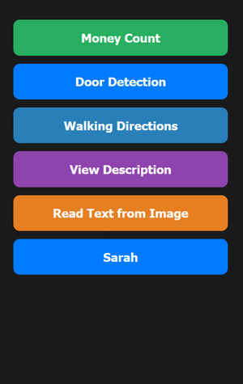
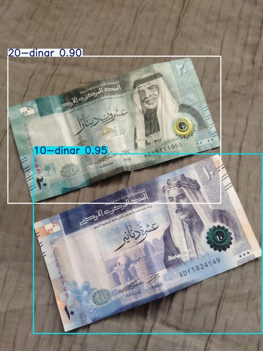
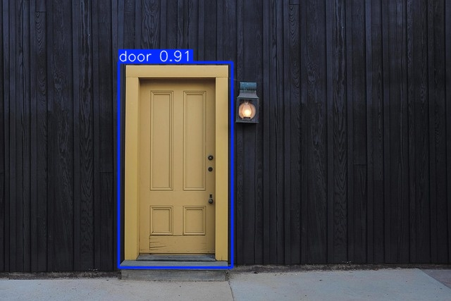

# AI Sight - Blind People

A PWA to help blind people navigate their way around the world.

**PWA**: a website that can turn into a phone application.
- Looks like a phone app: like gallery, calculator, etc.  
- Can have **OFFLINE** features  
- Works on all kinds of operating systems  

---

**Video Demo (1 min & 55s): [🎥 Sarah Feature – Demo](https://m.youtube.com/shorts/CQT7NVY8hOw)**

Presentation of AI Sight [Presentation Link](https://www.canva.com/design/DAG0E9aRTEk/VLnPrsdst3PRbWGfe3-xWA/view?utm_content=DAG0E9aRTEk&utm_campaign=designshare&utm_medium=link2&utm_source=uniquelinks&utlId=h45a1f11f82)

---

## Project Structure

- `ai_models/` — contains training code and model creation for **Money** and **Door** detection models  
- `pwa_app/` — the full PWA app including frontend (React), backend (TTS), and static assets  

---

### 🏠 Home Screen

- Central navigation hub with voice announcements  
- Made for blind users  

---

### 💰 Money Detection

- TensorFlow.js model runs fully in-browser  
- Recognizes multiple currency denominations (1, 5, 10, 20, 50)  
- Calculates **total** value and gives **audio feedback in dinars**  
- Uses about **10MB** of browser storage  
- See details and training code in the `ai_models/` folder  

---

### 🚪 Door Detection

- YOLOv8 model runs **fully offline** in-browser  
- Detects doors in real-time using the phone camera  
- Similar storage and loading as the Money model  
- Training code also available in `ai_models/`  

---

### 🧠 Fully Offline AI (On-Device)
- **Money Detection** and **Door Detection** run **entirely in the browser**  
- Models are built with **TensorFlow.js** and stored locally using **IndexedDB**  
- Works even when offline on phones  
- 100% **private** — no images or data sent to any server  

---

### 🚶 Walking Directions

- Real-time GPS-based navigation  
- Turn-by-turn voice instructions  
- Uses Google Maps and Directions APIs  

---

### 🔍 View Description

- Sends image to **Gemini AI** to describe the scene  

---

### 📖 Image Text Reader (OCR)

- Uses **Google OCR API**  
- Gemini AI helps organize and read the extracted text  

---

### 🤖 "Sarah" — AI Assistant on PC

- PC-only voice assistant  
- Helps with extended tasks and interactions  
- Demo video (1 min & 55s): [🎥 Sarah AI Assistant – Demo](https://m.youtube.com/shorts/CQT7NVY8hOw)

---

## Technology Stack

- **Frontend**: React + Vite  
- **AI/ML**: TensorFlow.js, YOLOv8 (models stored in IndexedDB)  
- **Maps**: Google Maps API, Directions API  
- **Speech**: Google TTS API, Web Speech API  

---

## Accessibility

Made specifically for visually impaired users:  
- Voice-first UI  
- Works with **TalkBack** (Android) and **VoiceOver** (iOS)  
- Button clicks trigger **spoken names**  
- Simple layout with high contrast and large buttons  
