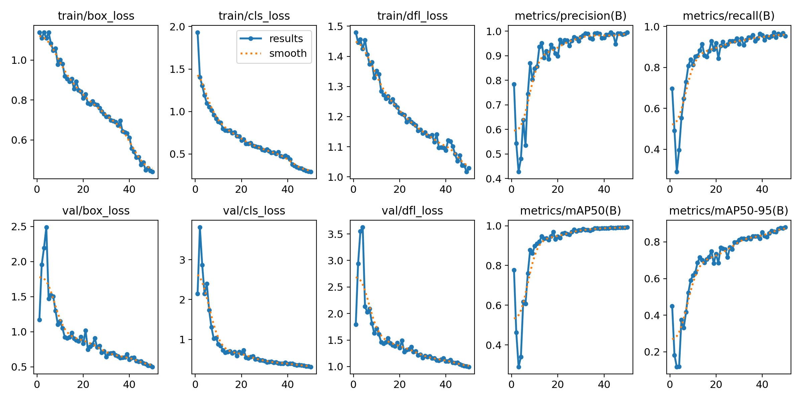
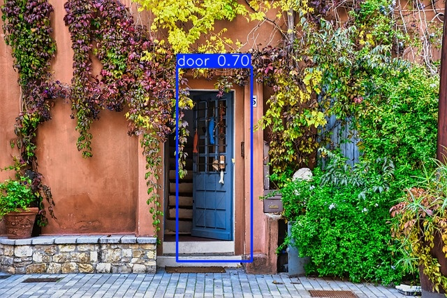
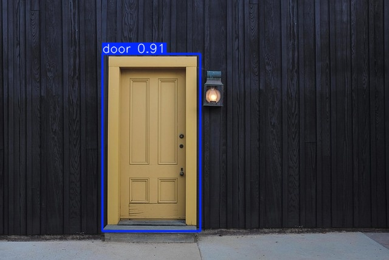

# 🚪 Door Detection Model — YOLO for Real-World Entry Recognition

Welcome to the **Door Detection Model** repository!  
This project uses **YOLOv8 (You Only Look Once)** to train a fast and lightweight object detection model that can recognize **doors** in real-world environments — useful for robotics, smart navigation, accessibility tools, or simply for opening new (digital) doors. 😉

---

## 🎯 Project Goal

To develop a compact and efficient object detection model that:

- Detects **doors** in various environments (indoor, outdoor, partial views)
- Works well on **mobile devices** and low-power hardware
- Can assist **autonomous robots**, **AR navigation**, or **visually impaired users** in recognizing entry points

---

## 📦 Dataset

We used the **Pintu (Door) Dataset**, a publicly available dataset containing annotated images of doors in real-life scenes.

- 🔗 **Dataset Source**: [Pintu Model on Roboflow Universe](https://universe.roboflow.com/objek-dalam-3-ayunda/pintu-model/)
- 📄 **License**: [CC BY 4.0](https://creativecommons.org/licenses/by/4.0/)

---

## 🚀 What's Inside

This repository includes:

- 🧠 YOLOv8 training notebook  
- 🗃️ Dataset setup and configuration (`data.yaml`)  
- 🏋️ Training logs, metrics, and evaluation graphs  
- 📸 Prediction images and inference examples  
- 📦 Exported models for deployment  

---

## 🧠 Notebooks

Included Jupyter notebooks:

- `door_model_train.ipynb` — Trains the YOLOv8 model on the door dataset  
- `door_model_conversion.ipynb` — Converts the model to formats like `.tflite`, `.onnx`, or TensorFlow.js  

---

## 📁 Exported Models

Final trained and converted models are located in the `best_models/` directory:

- `best.pt` — YOLOv8 PyTorch model  
- `best_float32.tflite` — TensorFlow Lite model  
- `best_web_model/` — ONNX / TensorFlow.js exports  
- `metadata.yaml` — Contains class labels and input shape  

---

## 📈 Training Results

After training with YOLOv8, here’s how the model performed:

| Metric              | Value         |
|---------------------|---------------|
| **Precision**       | 0.982 (98.2%) |
| **Recall**          | 0.960 (96.0%) |
| **mAP@0.5**         | 0.993 (99.3%) |
| **mAP@0.5:0.95**    | 0.878 (87.8%) |
| **Layers**          | 72            |
| **Parameters**      | 3,005,843     |
| **GFLOPs**          | 8.1           |
| **Inference Speed** | 2.5ms/image   |

---

## 📊 Training Graphs

Visual representation of training performance (YOLO-generated):

---

## 🧪 Example Predictions

Here are some successful detections from the trained model:

### 🚪 Example 1  

### 🚪 Example 2  

> 📸 *You can generate these during validation or inference using YOLOv8’s `predict()` method.*

---

## 🧰 Use Cases

This model can be used for:

- 🤖 Robot navigation and mapping (SLAM)  
- 🧭 AR-based spatial guidance  
- 🧑‍🦯 Accessibility tools for visually impaired users  
- 🏠 Smart home security and automation  

---

## 📎 Attribution

This project uses the **Pintu Dataset** published by the Roboflow Universe community.  
Thanks to open-source data and tools like **Ultralytics YOLO**, we're able to open new doors in AI — literally and figuratively.

---

**Created with ❤️ using YOLOv8 and a door to opportunity.**
