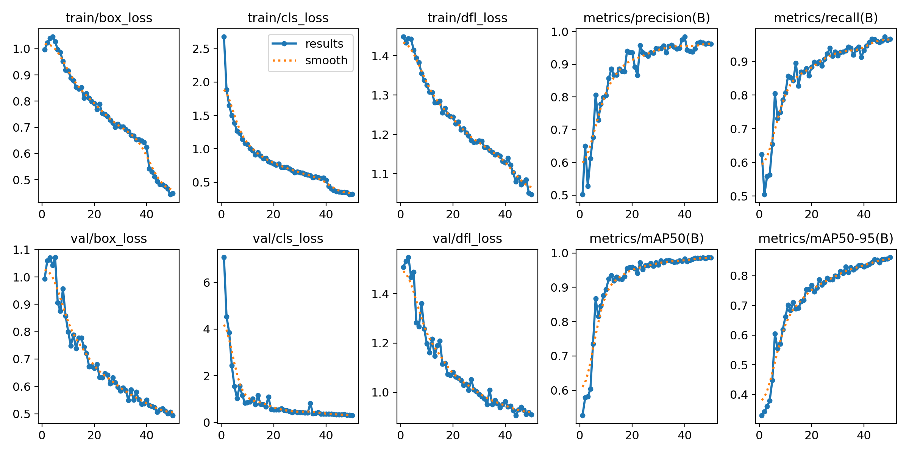
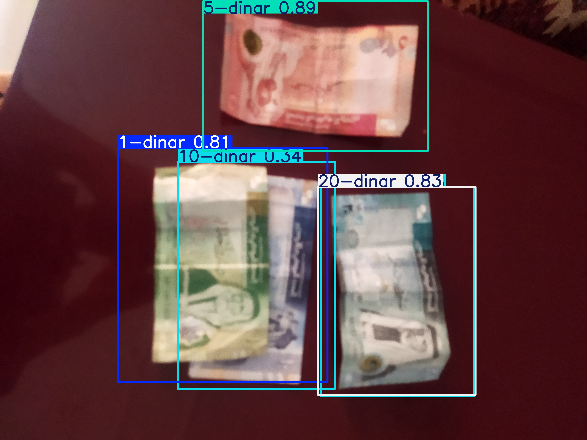

# 💵 Money Detection Model — YOLO for Paper Currency

Welcome to the **Money Detection Model** repository!  
This project uses **YOLO (You Only Look Once)** to train a lightweight, accurate object detection model focused on identifying **paper money** — with the goal of helping **blind and visually impaired people** recognize currency using their smartphones or web apps.

Since coins are easily recognized by touch, our model specifically targets **paper denominations**, making it faster, lighter, and more useful for real-world accessibility.

---

## 🎯 Project Goal

To develop a real-time, mobile-friendly object detection model that:

- Recognizes **paper money only**
- Helps blind individuals **count or verify currency** using their phone camera
- Runs efficiently in **PWAs** and low-powered devices

---

## 📦 Dataset

We used a custom dataset containing images of various currency notes, annotated for object detection. Coin classes were removed to keep the model focused and efficient.

🔗 **Dataset**: [Download via Roboflow](https://universe.roboflow.com/coinsvision/jordan-coins-detection-nqdbs/dataset/5)

---

## 🚀 What's Inside

This repository contains:

- 🧠 A training notebook using YOLOv8
- 📁 Dataset preparation and filtering
- 🏋️ Model training and evaluation
- 📊 Performance metrics and result visualizations
- 📸 Sample detections

---

## 🧠 Notebooks

It includes the following notebooks:

- `money_model_training.ipynb` — Used to train the YOLOv8 model on the custom dataset.
- `money_model_conversion.ipynb` — Used to convert the trained model to formats like TensorFlow Lite (`.tflite`) and web-compatible formats.

---

## 📁 Exported Models

Inside the `best_models/` directory, you'll find the final exported versions of the trained model:

- `best.pt` — YOLOv8 PyTorch model
- `best_float32.tflite` — TensorFlow Lite model (float32 precision)
- `best_web_model/` — Folder containing model version for web deployment (e.g. ONNX or TensorFlow.js)
- `metadata.yaml` — Configuration file with model metadata (class labels, input size, etc.)

---

## 📈 Training Results

Below is a summary of model performance after training:

| Metric              | Value        |
|---------------------|--------------|
| **Precision (B)**   | 0.962 (96.2%) |
| **Recall (B)**      | 0.967 (96.7%) |
| **mAP@0.5 (B)**     | 0.987 (98.7%) |
| **mAP@0.5:0.95 (B)**| 0.862 (86.2%) |
| **Fitness Score**   | 0.875 (87.5%) |
| **Layers**           | 72              |
| **Parameters**       | 3,006,623       |
| **GFLOPs**           | 8.1             |

---

## 🖼️ Training Graphs

Here's a summary of training progress from YOLO's built-in logging:

---

## 🧪 Example Predictions

Below are examples of the model detecting paper money with bounding boxes:

### ✅ Example 1  

### ✅ Example 2  

> 📸 *You can add more detection results by saving prediction images during inference.*
